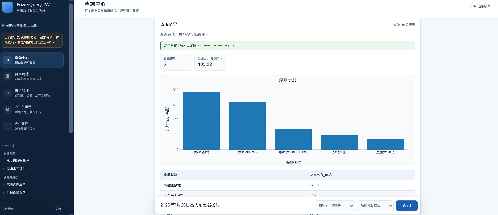
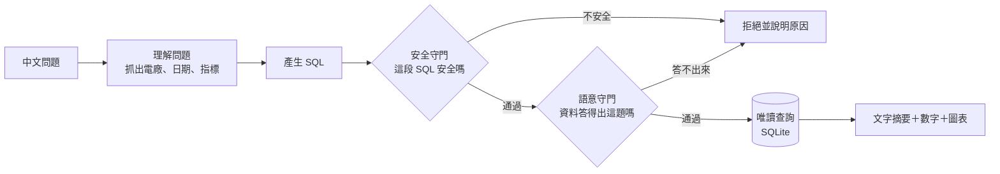

# PowerQuery TW｜台電開放資料 Text2SQL 智慧查詢系統

> 用中文直接問台灣電力資料，並在回答前先確認資料是否真的足以支持答案。


你用中文問一句，系統翻成 SQL、查台電的公開資料，再用文字、數字和圖表回答你。不必先去找一個會寫 SQL 的人。

跟一般 AI 問答不一樣的是：**它會先看這題資料答不答得出來。**答不出來就直說，並告訴你該怎麼問——而不是給一個看起來很像答案的數字。

---

## 1. 解決什麼問題

**想問的人不會查，會查的人不知道要問什麼。**

| | 有什麼 | 缺什麼 |
|---|---|---|
| **業務** | 問題：「這個月尖峰負載怎麼這麼高？」 | 不會寫 SQL，不知道資料長什麼樣 |
| **資訊** | 會寫 SQL，知道資料在哪 | 不知道今天該問什麼 |

所以要查一件事，得這樣繞：

```text
業務寫信 → 資訊猜意思 → 寫查詢 → 給一張表 → 「不是這個」→ 再一輪
```

五分鐘的問題，來回三天。問久了就懶得問——**最大的損失，是那些嫌麻煩而沒被問出口的問題。**

這個系統讓業務直接問，中間那段拿掉。

### 但中間那個人，不只會翻譯

他還會提醒你：這個數字不是你以為的那個數字。

> **2025 年台灣太陽能發了多少度？**

這題查得到答案。但這份資料只收台電**自己蓋**的場站，加起來只佔全國風光地熱的 **3～4%**。你拿到的數字，不是你問的那個數字——而且它看起來完全正常，你不會察覺。

熟悉這份資料的人會順口補一句「這個檔只有台電自建的喔」。只會翻譯的 Text2SQL 不會——SQL 跑得動、圖表畫得漂亮、數字沒有任何異狀，業務就拿去開會了。

**拿掉中間那個人，也拿掉了那句提醒。**所以系統得自己補上。它照樣回答，但把範圍講明白：

```text
只涵蓋台電自建的再生能源場站，合計 762,760 瓩，
約為全國風光地熱的 3～4%，不能當成全國或縣市總量。
```

真的算不出來的題目就直接擋下，並給幾個問得出答案的問法。

翻譯只是一半。另一半是**替你補上那句「但是」**——這也是為什麼這個專題的力氣大多花在守門，而不是產生 SQL。

---

## 2. 實際操作



問句直接用白話打進去，SQL 由規則產生、在守門下執行，結果連同圖表與明細一起回來。左上角標著
**離線分析服務已就緒**：這張圖裡沒有任何 API key 參與，固定分析走離線規則就答得出來，長尾問題才需要切換線上。

<!-- TODO: 補上操作示範動畫（查詢 → 守門攔截 → 改問法 → 圖表結果）—— 靜態截圖示範不了攔截與改寫那段 -->

---

## 3. 用了哪些技術？為什麼？

工具的選擇只有一條標準：**這個專題要能在別人的電腦上重現。**所以能離線就離線、能鎖版本就鎖版本、能少裝一樣就少裝一樣。

| 技術 | 為什麼選它 |
|---|---|
| **Python + uv** | uv 把每個套件的版本鎖進 `uv.lock`，換一台電腦重跑會得到一模一樣的環境 |
| **SQLite** | 整個資料庫就是一個檔案，不用安裝資料庫伺服器；而且能用唯讀模式打開，從根本上就改不到資料 |
| **sqlglot** | 把 AI 產生的 SQL 拆成語法樹逐項檢查。用關鍵字黑名單擋不住變形寫法，看語法樹才擋得住 |
| **FastAPI + uvicorn** | 自動產生 API 文件，前後端的介面契約不用再另外維護一份 |
| **原生 HTML / CSS / JS（不用前端框架）** | 評審要能在自己電腦上點兩下就跑起來，不該先叫人安裝 Node 和一套建置工具 |
| **Plotly.js** | 互動圖表。鎖固定版本並驗證檔案指紋（SRI），連不上網時自動退回本機畫的 SVG |
| **自己寫的字元 n-gram 檢索** | 中文問句沒有空格可以斷詞，改用連續字元比對，對錯字和別名比較穩。而且完全離線，不必付費呼叫向量服務 |
| **OpenAI Responses API** | 只有線上模式才用。以 JSON Schema 限制輸出格式；API key 只存在記憶體、重啟即失效，並要求對方不保存對話 |
| **pytest + ruff + GitHub Actions** | CI 全程離線、不需要 API key，任何人 clone 下來都能跑完整套測試 |

### 踩了哪些坑

以下每一條都是實際卡住、查出原因、修好並補上測試的紀錄。完整清單見 [log.md](log.md)。

| 坑 | 發生什麼事 | 怎麼解 |
|---|---|---|
| **抓不到官方資料** | Python 3.13 的系統憑證庫拒絕台電官方端點的憑證鏈，下載直接失敗 | 改用 `certifi` 的憑證庫 —— **沒有**關掉 TLS 驗證來換方便 |
| **官方 CSV 少了一欄** | 資料集頁面匯出的 CSV，會遺失 JSON 原始回應最上層的時間戳 | 改接 JSON 端點，不用網頁匯出的 CSV |
| **公開部署完全登不進去** | PowerShell 把密碼字串傳給 Python 時偷偷加了 UTF-8 BOM，64 字元的密碼進到 Python 變成 69 位元組，雜湊的是「BOM＋密碼」，整份帳號名冊沒有一組密碼驗得過 | Python 端改用 `utf-8-sig` 解碼，只剝除換行字元 —— 其他空白可能真的是密碼的一部分 |
| **加了語料卻沒有變聰明** | 以為「把問句加進語料就答得出來」，實測後離線模式還是全部失敗 | 查出離線走的是規則路由、語料只餵線上檢索。**兩條路要各自處理**，否則切換模式就答不出來 |
| **新功能偷走舊題目** | 新增「資料範圍」意圖時用了包含比對，結果「大觀發電廠有哪些設備」被判成「有哪些電廠」，離線評測執行率從 100% 掉到 95% | 改成完全比對，三題被偷走的題目全部寫進測試釘住 |
| **文件裡的限制過期了** | README 寫「不能回答發電量」，但資料庫裡早就有了。**過期的限制說明比沒有更糟** —— 它讓人相信一件不再為真的事 | 每條限制都必須附可驗證的條件，測試每次跑都重驗一次；一旦答得出來了，測試就會失敗並要求更新說明 |

還有一個**已知但尚未修**的：資料版本編號只看來源檔內容，不含建庫程式的 schema 版本，所以來源沒變時服務端拿不到新的資料表。已記錄在 [SPEC 的已知待修](docs/SPEC.md#已知待修)，沒有假裝不存在。

---

## 4. 架構



四層各管一件事：

| 層 | 負責 | 關鍵設計 |
|---|---|---|
| **資料層** | 把八份格式不一的開放資料整理成一個資料庫 | 星狀模型；底層用英文欄位，只開放經審核的中文檢視給 AI 查 |
| **查詢層** | 理解問題、產生 SQL | 離線走規則、線上才叫 LLM，但**兩邊共用同一套守門** |
| **守門層** | 擋住不安全的 SQL 和答不出來的問題 | 安全檢查看語法樹；語意檢查分「拒答／揭露限制／請你講清楚」三級 |
| **呈現層** | 網頁、API、命令列 | 圖表格式由後端白名單決定，不適合畫圖就誠實不畫 |

**所有限制都在後端執行，不是靠提示詞拜託 AI 遵守。**帳號看得到哪些電廠的資料，是在 SQL 通過安全檢查後由程式改寫查詢達成的 —— AI 就算想繞也繞不過去。

完整流程圖、守門規則與資料模型見 [docs/SPEC.md](docs/SPEC.md)。

---

## 5. 工程亮點

| 做到什麼 | 怎麼做的 |
|---|---|
| **自然語言查詢** | 中文問題轉成受限制的 SQL，離線與線上兩種模式共用同一套守門 |
| **雙層守門** | 一層擋不安全的 SQL，一層處理「跑得動但答案不是你要的」——算不出來的擋下，有範圍限制的照答但講明白 |
| **帳號權限** | 依帳號綁定的電廠改寫已驗證的 SQL；同一句「列出台中發電廠所有設備」，全權限帳號 14 筆、林口帳號 0 筆 |
| **職責分離** | 發布資料需要第二個人核准，提案人不能核准自己的提案；例外要明寫且會留痕 |
| **會自己長大的語料** | 成功查詢通過六道驗證後才進正式語料並重建索引；未驗證的不准進、題庫不准當訓練資料 |
| **資料工程** | 寬表轉長表、跨資料集名稱對齊、星狀模型，對齊用裝置容量客觀驗證而非字串相似度 |
| **不會過期的限制說明** | 「答得出什麼」全部現查資料庫；「答不出什麼」每條都附可驗證條件，過期就測試失敗 |
| **可重現評測** | 區分語料內／語料外題型，量測執行正確率與守門誤攔率，並做 ablation 量化各模組貢獻 |

幾個實測數字：

| 項目 | 結果 |
|---|---:|
| 機組主檔對齊 | 175 台，100% |
| 每日出力長表 | 36,928 筆（2025-01-01 ～ 2026-07-31，577 天） |
| 再生能源站名對齊 | 64／65（98.5%），未處理前只有 10／65 |
| 已識別並寫進資料庫的資料陷阱 | 10 類 |
| 離線評測 | 意圖 80／80、執行 60／60（語料內外各 30）、語意陷阱守門 44／45・端到端 45／45 |
| 守門誤攔 | 0／20（合法問題沒有被錯誤拒絕） |
| SQL 攻擊題庫 | 16／16 全數攔截 |
| 測試 | 751 項，分布在 39 個測試檔，CI 全程離線不需 API key |

逐項數字、驗收條件、消融與最近幾次的趨勢見 **[reports/eval_summary.md](reports/eval_summary.md)** —— 由 `make eval` 產生，測試釘住它與報告一致。那張表同時標明**線上模式的答題準確率未量測**：上面這些都是離線規則路徑的成績。

### 資料來源

全部來自[政府資料開放平臺](https://data.gov.tw/)的台電公開資料，共八份：

| 資料集 | 提供什麼 | 更新頻率 |
|---|---|---|
| [水火力發電廠位置及機組設備（8934）](https://data.gov.tw/dataset/8934) | 電廠、機組、燃料、裝置容量、商轉日期 | 不定期 |
| [過去電力供需資訊（19995）](https://data.gov.tw/dataset/19995) | 每日尖峰負載、備轉容量、尖峰時刻機組出力 | 每月 |
| [未來兩年機組大修停機排程（35393）](https://data.gov.tw/dataset/35393) | 解釋某台機組為什麼長時間零出力 | 每 6 個月 |
| [各種發電方式之發電成本（10856）](https://data.gov.tw/dataset/10856) | 各發電方式的每度成本 | 年度 |
| [再生能源各場址資料（17141）](https://data.gov.tw/dataset/17141) | 風、光、地熱的場址主檔 | 每月 |
| [自建各類再生能源發電量（17140）](https://data.gov.tw/dataset/17140) | 目前唯一的「發電量」資料，月粒度 | 每月 |
| [核能發電廠位置及機組設備（10858）](https://data.gov.tw/dataset/10858) | 核能機組裝置容量 | 有異動時 |
| [各機組發電量即時資訊（8931）](https://data.gov.tw/dataset/8931) | 民營、汽電共生、儲能等彙總欄位的裝置容量 | 每 10 分鐘 |

> [!WARNING]
> 「過去電力供需資訊」採**滾動視窗**，只提供上一年度到上個月的資料，舊資料會被覆蓋。專案會定期封存原始檔並記錄版本與涵蓋日期，否則今天的結果明年就重現不出來。

每一份下載後都以檔案內容的 SHA-256 封存，相同內容不會重複存一份。整條「來源 → 清洗 → 對齊 → 資料表」的血緣記在 [docs/lineage/](docs/lineage/)，用試算表軟體就能打開。

---

## 6. 快速開始

### 只想看它跑起來（Windows）

點兩下 `啟動.bat`，等它自己裝好環境、建好資料庫，瀏覽器會開在 <http://127.0.0.1:8765/>。

不需要 OpenAI API key —— 預設是離線模式，用規則產生 SQL，一樣有完整的守門與圖表。

### 開發者

```bash
make setup   # 安裝相依套件（uv）
make db      # 從版控裡的 taipower_align/ 建 SQLite 快照（離線，約 3 秒）
make serve   # 啟動網頁服務 http://127.0.0.1:8000
```

直接從命令列問一句：

```bash
uv run powerquery "2026年7月備轉容量率最低是哪一天？"
```

跑測試與離線評測：

```bash
make test-all   # 格式檢查 + lint + 全套測試
make eval       # 在固定快照上跑四份題庫，不需要 API key
```

想看權限改寫的實際效果（同一句話、不同帳號、不同結果）：

```bash
uv run python scripts/demo_plant_scope.py
```

線上模式、API key 處理方式與各分頁功能見 [SERVING.md](docs/SERVING.md)。

---

## 7. 深入閱讀

| 想知道 | 看這裡 |
|---|---|
| **怎麼做的、為什麼這樣做、踩了什麼坑** | **[docs/SPEC.md](docs/SPEC.md)** |
| 完整系統規格（分層、表定義、守門規則全表） | [設計規格](docs/superpowers/specs/2026-09-09-text2sql-taipower-design.md) |
| 怎麼用、執行模式、自動語料學習 | [SERVING.md](docs/SERVING.md) |
| 資料字典 | [DATA_DICTIONARY.md](docs/DATA_DICTIONARY.md) |
| 系統卡：用途、可回答範圍、已知偏誤 | [SYSTEM_CARD.md](docs/SYSTEM_CARD.md) |
| 資料對齊方法與驗證結果 | [taipower_align/README.md](taipower_align/README.md) |
| 資料血緣（五份 CSV，試算表可開） | [docs/lineage/](docs/lineage/) |
| 資料擴充計畫 | [docs/DATA_ROADMAP.md](docs/DATA_ROADMAP.md) |
| 公開離線服務架構 | [PUBLIC_OFFLINE_SERVING.md](PUBLIC_OFFLINE_SERVING.md) |
| API 契約 | [src/serving/API_CONTRACT.md](src/serving/API_CONTRACT.md) |
| 逐儲存點的開發紀錄與回退方式 | [log.md](log.md) |

---

## 8. 授權

**資料**：台灣電力公司公開資料，依「[政府資料開放授權條款－第 1 版](https://data.gov.tw/license)」使用。再次散布時請保留資料提供機關顯名、快照版本與來源資訊。

**程式與自寫文件**：本專案目前**未提供 `LICENSE` 檔**。政府資料開放授權條款只適用於其涵蓋的開放資料，不會自動授權本專案的程式碼、介面、設計規格或自寫文件；除另有書面授權外，請勿推定採用任何開源授權。

台電資料的顯名不代表台灣電力公司為本專案、資料轉換結果或分析結論背書。本專案使用的是固定時間取得的**快照，不是即時資料服務**，請勿作為供電或調度決策依據。

完整顯名、再散布規則與排除清單見 [ATTRIBUTION.md](ATTRIBUTION.md)。

---

本專題以 **資料工程 × LLM 應用 × 軟體安全 × AI 評測 × 使用者體驗** 為核心。目標不是做一個會產生 SQL 的聊天機器人，而是把「會問問題的人」和「查得到答案的資料」直接接起來——並且在中間那個人被拿掉之後，仍然有人為答案的正確性負責。
