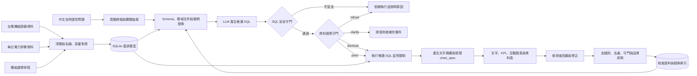

# PowerQuery TW｜台電開放資料 Text2SQL 智慧查詢系統

> 用自然語言探索台灣電力資料，並在回答前先確認資料是否真的足以支持答案。


PowerQuery TW 是一套以 **Text2SQL** 為核心的畢業專題。使用者能直接用中文詢問台電公開資料，系統負責理解問題、產生 SQL、驗證查詢安全性與資料語意，最後以文字、指標、圖表及表格呈現結果。

本專題不只追求「能產生 SQL」，更重視一個實務資料系統應具備的能力：**知道哪些問題可以回答、哪些答案需要揭露限制，以及哪些問題不應產生一個看似合理但其實錯誤的數字。**

> [!IMPORTANT]
> 目前已完成兩份台電資料集的清理、長表轉換、機組名稱對齊及語意陷阱盤點；Text2SQL 管線、API 與前端仍依規格分階段開發中。本文會明確區分「已完成成果」與「規劃功能」。

## 專題亮點

| 能力面向 | 我們的做法 | 展現的專業能力 |
|---|---|---|
| 自然語言查詢 | 中文問題轉換為受限制的 SQL | LLM 應用、Prompt／Context Engineering |
| 增量語料學習 | 將成功查詢與人工修正轉成候選語料，驗證後自動更新檢索索引 | MLOps、資料治理、Feedback Loop |
| 資料工程 | 寬表轉長表、跨資料集名稱對齊、星狀模型 | ETL、資料建模、資料品質管理 |
| 查詢安全 | 僅允許唯讀查詢，限制資料表、欄位、筆數與執行時間 | SQL AST 驗證、安全設計 |
| 語意治理 | 在執行前判斷問題是否可答，分成拒答、揭露與澄清 | Domain Knowledge、Guardrail 設計 |
| 可重現評測 | 區分語料內／語料外題型，量測執行正確率與守門誤攔率 | AI Evaluation、實驗設計 |
| 視覺化體驗 | 依結果自動選擇圖表、查詢階段回饋、可取消與無障礙設計 | Data Visualization、RWD、Accessibility |

## 我們要解決的問題

一般 Text2SQL 系統可能產生語法正確、可成功執行，卻在領域上完全錯誤的查詢。例如：

```text
使用者：台中電廠去年總發電量是多少？
```

直接對每日資料做 `SUM()` 會得到一個數字，但這個答案至少有兩個問題：

1. 台電資料記錄的是「每日系統尖峰時刻的瞬時出力」，單位為萬瓩，不是每日發電量；跨日加總沒有正確的物理意義。
2. 台中電廠部分氣渦輪機組被收在全系統的殘差欄位，無法從現有資料完整拆回台中電廠總量。

因此，本系統的正確行為不是硬給答案，而是拒絕錯誤計算、說明原因，並建議可被資料支持的替代問法，例如：

```text
「比較 2026 年各月尖峰日的台中燃煤機組出力」
「查詢 2026 年 7 月全系統尖峰負載最高的日期」
```

## 系統設計

以下為規格定案後的目標架構；目前已完成圖中「資料擷取／清理」及「名稱與容量對齊」部分。



### 雙守門機制

| 守門層 | 檢查內容 | 避免的風險 |
|---|---|---|
| SQL 安全守門 | 唯讀限制、允許清單、SQL AST、查詢筆數及逾時 | 修改資料、任意查詢、資源濫用 |
| 資料語意守門 | 指標定義、單位、時間粒度、資料涵蓋與欄位完整性 | 「SQL 能跑，但答案是錯的」 |

語意守門不採用單一的「通過／拒絕」，而是依風險分級：

- `refuse`：問題會導致錯誤結論，例如把跨日瞬時功率加總成發電量。
- `disclose`：結果仍可參考，但必須顯示資料缺漏或估計限制。
- `clarify`：名稱或日期條件不明確，需要使用者補充後才能查詢。

完整 9 條規則與 SQL 形狀定義請見[專案規格附錄 A](docs/superpowers/specs/2026-09-09-text2sql-taipower-design.md#附錄-a語意守門規則全表)。

### 增量語料學習

系統規劃建立可追溯的語料更新流程，讓常見新問法與人工修正能逐步改善 Text2SQL 表現：

```text
成功查詢／人工修正
        ↓
候選 question–SQL pair
        ↓
去識別化 → 去重 → SQL 安全驗證 → 語意驗證 → 結果一致性測試
        ↓
staging corpus → benchmark 回歸通過 → 正式 corpus
        ↓
自動重建 TF-IDF／向量檢索索引並留下版本紀錄
```

這裡的「自動訓練」主要是**自動擴充高品質語料並重建檢索索引**，不是讓模型直接把每次回答當成正確答案。未經驗證的查詢不得進入正式 corpus，benchmark 也不得成為訓練資料，以防止錯誤累積與評測洩漏。

### 自動圖表回答

查詢結果除了文字與資料表，也能依欄位型別及問題意圖產生圖表：

| 資料形狀 | 建議圖表 | 適用問題 |
|---|---|---|
| 日期＋數值 | 折線圖 | 尖峰負載或備轉容量的時間趨勢 |
| 類別＋數值 | 長條圖 | 不同機組、燃料或電廠比較 |
| 兩個連續數值 | 散點圖 | 裝置容量與實測最大出力關係 |
| 單一或不適合繪圖的結果 | KPI／資料表 | 最大值、明細或文字型結果 |

後端只產生白名單格式的 `chart_spec`，前端使用 Plotly 渲染；圖表標題、座標軸、單位、資料來源與限制揭露皆須由查詢結果推導。若結果不適合視覺化，系統應誠實回傳 `chart_spec: null`，而不是硬畫一張誤導性圖表。

## 已完成的資料工程成果

我們已將台電「水火力發電廠位置及機組設備」與「過去電力供需資訊」完成跨資料集對齊，並以裝置容量與歷史實測最大值進行客觀驗證，而非只依賴字串相似度。

| 成果 | 數量／結果 |
|---|---:|
| 機組主檔對齊 | **175 台，100% 完成** |
| 每日供需欄位 | 64 個機組／彙總欄位 |
| 可對應機組主檔的欄位 | **43 個（67%）** |
| 轉換後長表 | **36,928 筆** |
| 目前資料期間 | 2025-01-01 ～ 2026-07-31，共 577 天 |
| 已識別資料陷阱 | 10 類 |

其餘 21 個欄位主要屬於核能、民營電廠、汽電共生及再生能源彙總，本來就不在該機組主檔的涵蓋範圍內，並非單純的配對失敗。詳細方法、欄位定義及驗證結果請見 [`taipower_align/README.md`](taipower_align/README.md)。

## 資料整理踩坑：有電廠名單，還不能直接分權限

一開始想把資料全部掛到電廠，再讓使用者只看自己廠的資料。但查下去發現：**原始資料有的是單一機組、有的是整座電廠、有的是好幾個電廠加在一起，不能全部用同一種方式處理。**

### 坑一：22 個電廠不是全部資料的範圍

原本的機組設備資料只有 22 筆台電水火力電廠／分廠，但每日供需資料還包含核能、民營電廠，以及風力、太陽能、汽電共生合計。只拿這 22 筆去配，部分資料一定找不到所屬電廠。

**處理方式：**核對台電與能源署的官方資料，補上 9 個民營電廠及核一、核二、核三，主檔擴充為 **34 筆**，並記錄不同叫法與來源。這份名單涵蓋目前專案需要的電廠，不是全臺所有發電設施名冊。前面提到的 43 欄是「已有機組主檔對照」的範圍；補齊電廠名單，不代表也補齊了每台機組的設備資料。

### 坑二：合計數字不能硬拆給各電廠

例如資料只有「離島合計出力 15 萬瓩」（示意數字），包含尖山、塔山、珠山。知道合計裡有哪些廠，也無法知道這 15 萬瓩各廠占多少，更不能把 15 萬瓩直接當作尖山出力。

「氣渦輪」也有同樣問題：原始欄位是全系統合計，目前機組主檔只配到台中部分機組。若把整筆掛給台中，就會把其他來源的出力一起算進去。

**處理方式：**逐欄確認資料範圍，將每日 64 個欄位分成 **58 個單廠欄位、6 個共用彙總欄位**。共用彙總為離島、其他小水力、氣渦輪、汽電共生、風力發電、太陽能發電。查詢時保留原始合計，標示已知涵蓋電廠；組成不完整就明講，不能假裝已經拆出各廠數值。同一廠的多台機組合計，仍按該廠權限處理。

### 坑三：找不到機組，不代表不知道是哪個電廠

138 筆歲修中，原本有 13 筆找不到對應的機組 ID。核對後發現，大潭 8、9 號機和興達新一號機可以確認所屬電廠，只是舊機組主檔缺資料；「立霧」則能確認屬於東部發電廠，但不能硬指定成某一台機組。

**處理方式：**把「確認電廠」和「確認機組」分開記錄。現在 **138 筆都能確認電廠，其中 125 筆有機組 ID，13 筆只確認到電廠**。這 13 筆保留空白的機組 ID，不捏造資料，也不能把興達新一號機誤配到舊燃煤一號機。

### 權限怎麼分

本專案採用以下已確認規則：

| 資料範圍 | 本廠帳號 | 全部權限帳號 |
| --- | --- | --- |
| 單廠明細或同廠機組合計 | 只能看自己廠 | 全部可看 |
| 跨廠彙總 | 可看，標示合計範圍 | 可看 |
| 全系統負載、備轉容量、發電類別成本 | 可看 | 可看 |
| 真正尚未確認所屬電廠的資料 | 可看 | 可看 |

最後一項是本專案明確選擇的開放規則。**一旦確認所屬電廠，就改依該廠權限處理；不能只因機組 ID 是空白，就把資料當作所有人共用。**

### 已完成的檔案與待接上的部分

| 檔案 | 用途 |
| --- | --- |
| [plants.csv](taipower_align/plants.csv) | 34 筆電廠主檔，包含編號、名稱、類型、燃料、別名與來源 |
| [daily_plant_scope.csv](taipower_align/daily_plant_scope.csv) | 64 個每日欄位的單廠／共用分類，以及已知電廠對照 |
| [outage_plant_map.csv](taipower_align/outage_plant_map.csv) | 138 筆歲修的電廠對照，區分是否已確認機組 |

上述 CSV 已接進建庫流程：`dim_plant_scope`、`b_column_scope`、`bridge_b_column_plant`、`outage_scope` 四張授權對照表由這三個檔產生；查詢時再由 [`scope_guard`](src/text2sql/scope_guard.py) 依帳號綁定的電廠改寫已通過安全驗證的 SQL，把每個受管檢視包成只含該帳號可見列的子查詢。限制在後端執行，不是靠提示詞要求 AI 遵守。

**尚未完成的是帳號本身**：目前仍只有單一共用管理員帳號，還沒有「帳號 → 電廠」的綁定，因此還沒有任何入口會帶入電廠範圍。

還有一個必須一起處理的問題：**電廠編號不能每次按名稱排序重新編。** 否則新增一座廠後，原本帳號綁定的編號可能變成另一座廠。這次保留原有 1–22，新增接續 23–34。既有建庫程式仍按名稱排序指派編號，因此改為在建庫時把三個 CSV 的編號與重建後的名稱逐筆比對：只要電廠、每日欄位或歲修事件的編號漂移，或有新欄位還沒指定授權範圍，就中止建庫並說明原因，不讓錯誤的對照靜默沿用。

完整欄位定義、官方來源與限制見[電廠主檔說明](taipower_align/PLANTS.md)。

## 資料整理踩坑：兩個檔案講同一批電廠，卻對不起來

再生能源的場址主檔（17141）與月發電量（17140）是同一個機關發布的一對檔案，
理論上用「發電站名稱」就能串起來。實際下載後發現四個坑。

### 坑一：小計混在明細裡，容量會多算一倍

97 列場址中有 4 列其實是小計，`發電站編號` 寫成「陸域風力小計」，名稱欄塞「18站」，
地址欄塞「含試運轉中機組」。直接 `SUM(裝置容量)` 會得到 **1,514,419 瓩**，
但真正的明細合計只有 **757,960 瓩**。

**處理方式：** 依 `發電站編號` 是否含「小計」剔除彙總列，並把兩個數字都寫進對齊報告，
讓人一眼看出差異。同一份資料的 8931 也有 10 列小計混在 215 列中，用同一條規則處理。

### 坑二：同一個電廠，兩個檔寫法不一樣

場址主檔寫「石門風力發電站」，發電量檔寫「石門風力」。直接 join 的結果是
**65 站只對上 10 站**。另外還有欄位名稱與值都是 `中文/English` 黏在一起，
而且官方有一筆漏掉分隔符，變成 `彰工風力Changgong Wind Power`。

**處理方式：** 先取雙語字串的中文側（沒有分隔符時額外剝除結尾的拉丁字母），
再去掉結尾的「發電站」，對齊率提升到 **64／65（98.5%）**。
剩下的兩組命名變體以裝置容量推算容量因數（15.0% 與 12.6%，都在合理範圍）佐證後，
寫進 [`configs/renewable_overrides.yaml`](configs/renewable_overrides.yaml) 並附依據，
程式本身不做任何猜測。

### 坑三：一格壞掉的數字，怎麼確定真值

澎湖湖西風力 2024-07 的發電量是 `357,156.00 2` —— 有千分位逗號、小數點，尾巴還多一個字元。
直接取前綴數字是猜測，直接丟掉則會讓該站少一個月。

**處理方式：** 解析器把這種值標為 `suspect` 且**不列入加總**，再去台電 11307 簡明月報對答案。
月報表 2-2 顯示該站六部機組毛發電量合計 382,722 度、站級廠用電量 25,566 度，
相減正好 357,156 度。確認後才以 overrides 記錄修復。

這趟交叉驗證還意外釐清一件事：**這一欄是淨發電量，不是毛發電量。**
拿同月份八個站逐一比對，七個站的 CSV 數值與月報的淨發電量欄完全相同
（第八個就是上面那格）。這個定義原始資料沒有寫，靠比對才確定。

### 坑四：只涵蓋 3～4%，但看起來像全國資料

這兩份檔名叫「再生能源」，實際上只收台電**自己興建**的案場，合計約 758 MW。
對照全國風光地熱約 19,000 MW，涵蓋率只有 **3～4%**。

**處理方式：** 這是四個坑裡最危險的一個——前三個會讓數字算錯，這個會讓數字**看起來很合理但差一個數量級**。
接入時必須強制附上「僅限台電自建場站」的範圍揭露，不能讓「2025 年台灣太陽能發了多少度」
這類問題拿這份資料作答。

### 目前成果

| 項目 | 結果 |
| --- | --- |
| 站名對齊 | 64／65（98.5%），未處理前為 10／65 |
| 場址明細 | 93 列，容量 757,960 瓩，縣市解析 93／93 |
| 發電量 | 1,976 列，1,959 筆可用、16 筆缺值、1 筆修復 |
| 未對齊 | 0。`中屯風力` 經月報證實存在（4,800 瓩、112.10.19 起安全性停機），以補充檔補上並標為 `supplemented` |
| 已上線 | `dim_re_site` 65 站、`fact_re_monthly` 1,976 月、`v_re_generation` 可查詢 |

對齊率與覆蓋率分開報：**對齊率 98.5%** 只算兩個官方檔真正對上的 64 站，
**覆蓋率 100%** 才包含補充檔補上的那一站，避免把「補上的」講成「對上的」。
任何查到 `v_re_generation` 的問題都會附 `RENEWABLE_SELF_BUILT_ONLY` 範圍揭露。

缺值一律存 NULL 而不是 0，`suspect` 值不列入加總，未對齊的名稱保留原值。
規則放在 [`src/align/renewable.py`](src/align/renewable.py)（無 I/O 純函式），
人工裁決放在 config，產出 [re_station_crosswalk.csv](taipower_align/re_station_crosswalk.csv)
與 `reports/alignment.json` 的 `renewable` 區段，對齊率低於 90% 時整份報告判定 fail。
完整盤點與接入順序見[資料擴充計畫](docs/DATA_ROADMAP.md)。

## 資料模型

規劃以 SQLite 建立星狀模型，將原始資料的複雜欄名與不同粒度轉換成對 LLM 較穩定的語意層：

```text
dim_plant ──< dim_unit ──< bridge_b_column
                              │
                              ▼
                       fact_daily_peak
                              │
                              ├── dim_date
                              └── dim_outage

dim_re_site ──< fact_re_monthly        台電自建再生能源，月粒度淨發電量

meta_manifest   資料版本、涵蓋期間與來源
meta_pitfall    已知限制、受影響對象與守門規則依據
v_*             提供給 Text2SQL 的中文語意檢視
```

這個設計將「儲存結構」與「LLM 可見的查詢介面」分離：底層採容易維護的英文欄位與正規化結構，模型只允許查詢經審核的中文 `v_*` views。

## 資料來源

| 台電開放資料 | 用途 | 更新頻率 |
|---|---|---|
| [水火力發電廠位置及機組設備（資料集 8934）](https://data.gov.tw/dataset/8934) | 電廠、機組、燃料、裝置容量與商轉日期 | 不定期 |
| [過去電力供需資訊（資料集 19995）](https://data.gov.tw/dataset/19995) | 每日尖峰負載、備轉容量及尖峰時刻機組出力 | 每月 |
| 機組歲修排程（`d006008`） | 解釋特定機組長時間停機或零出力 | 事件更新 |
| [各種發電方式之發電成本（資料集 10856）](https://data.gov.tw/dataset/10856) | 年度、分發電方式的每度成本，區分審定與自編決算 | 年度 |
| [再生能源各場址資料（資料集 17141）](https://data.gov.tw/dataset/17141)、[自建再生能源發電量（17140）](https://data.gov.tw/dataset/17140) | 台電自建風光地熱的場址主檔與月發電量 | 每月 |
| [核能發電廠位置及機組設備（資料集 10858）](https://data.gov.tw/dataset/10858)、[各機組發電量即時資訊（8931）](https://data.gov.tw/dataset/8931) | 補無機組主檔欄位的裝置容量 | 有異動時／每 10 分鐘 |

> [!WARNING]
> 「過去電力供需資訊」採滾動視窗，只提供上一年度及本年度至上月份資料，舊資料可能被覆蓋。專案需定期封存原始檔，並將資料版本與涵蓋日期寫入 `meta_manifest`，才能維持可重現性。

### 已接入（原「規劃中」）

以下三份已完成盤點並接入。完整的欄位、陷阱與處理方式見[資料擴充計畫](docs/DATA_ROADMAP.md)。

| 台電開放資料 | 補的缺口 | 實測規模 |
|---|---|---|
| [再生能源各場址資料（資料集 17141）](https://data.gov.tw/dataset/17141) | 風、光、地熱的場址主檔；`裝置容量(瓩)` 與現有機組主檔同單位 | 97 列（含 4 列小計） |
| [自建各類再生能源發電量（資料集 17140）](https://data.gov.tw/dataset/17140) | **目前唯一的「發電量」資料**，單位為度、月粒度 | 1,976 列，2024-01～2026-07 |
| [各機組發電量即時資訊（資料集 8931）](https://data.gov.tw/dataset/8931) | IPP、汽電共生、儲能與風光彙總欄位的裝置容量 | JSON 215 列，每 10 分鐘更新 |

> [!WARNING]
> 17141 的 97 列中有 4 列是小計，直接加總裝置容量會重複計算近一倍（1,514,419 瓩
> vs 明細 757,960 瓩）；17141 與 17140 的發電站名稱直接 join 只有 10 個對得上，
> 去掉「發電站」後綴後為 62 個，其餘 3 組另行處理。8931 必須接 JSON 端點，
> 資料集頁面匯出的 CSV 會遺失頂層的 `DateTime` 時間戳。

資料使用遵循「政府資料開放授權條款－第 1 版」。

## 快速開始：重現目前成果

目前的資料對齊流程只使用 Python 標準函式庫，不需額外安裝套件。

```bash
cd taipower_align
python align.py    # 建立 crosswalk.csv 與人讀版驗證報告
python final.py    # 將每日寬表轉為 daily_long.csv，執行語意驗證
```

如需從官方來源更新資料：

```bash
python fetch.py
python fetch.py --extra   # 額外下載備轉容量、歲修排程等資料
```

執行後的重要產物：

| 檔案 | 說明 |
|---|---|
| `taipower_align/crosswalk.csv` | 台電兩套命名系統的欄位與機組對照表 |
| `taipower_align/daily_long.csv` | 每日供需寬表轉換後的分析用長表 |
| `taipower_align/crosswalk.txt` | 容量比值、未對應欄位與異常警示 |
| `taipower_align/final.txt` | 語意驗證、缺漏機組與欄位分類 |

## 評測設計

本專題會同時評估「查詢做不做得到」與「系統會不會阻止錯誤答案」，避免只用 SQL 字串相似度美化成果。

| 指標 | 衡量目的 |
|---|---|
| SQL 執行正確率 | 查詢能否執行並得到正確結果 |
| Result Match | 生成 SQL 與標準答案的查詢結果是否一致 |
| 語意陷阱命中率 | 應阻擋或警示的題目是否正確辨識 |
| 守門誤攔率 | 合法問題是否被錯誤拒絕 |
| 語料內／語料外表現 | 區分記憶題型與真正泛化能力 |

規劃驗收基準為：語意陷阱命中率至少 95%、誤攔率不高於 5%，並獨立呈現 `in_corpus=false` 題組結果。另以 ablation study 比較移除檢索、對齊資訊與語意守門後的表現差異，量化各模組的實際貢獻。

## 專案結構

```text
text2sql/
├── README.md                         # 專案入口
├── taipower_align/                   # 已完成：資料清理、對齊與驗證
│   ├── align.py
│   ├── final.py
│   ├── fetch.py
│   ├── crosswalk.csv
│   └── daily_long.csv
├── scripts/                          # 台電公開資料下載腳本
├── docs/AI_AGENT_COLLABORATION.md    # AI Agent 多人協作與整合規範
├── docs/superpowers/specs/           # 系統、資料、評測完整規格
└── 參考資料/                          # UI、架構、元件與 API 參考文件
```

後續實作將依規格加入 `src/ingest`、`src/align`、`src/text2sql`、`src/serving`、`corpus`、`benchmarks` 與 `tests` 等模組。

## 開發里程碑

| 階段 | 內容 | 狀態 |
|---|---|:---:|
| Phase 1 | 原始資料盤點、下載與版本管理 | ✅ |
| Phase 2 | 名稱對齊、長表轉換與資料陷阱分析 | ✅ |
| Phase 3 | SQLite 星狀模型與中文語意檢視 | ✅ |
| Phase 4 | Text2SQL 生成、檢索、失敗重試與增量語料索引 | ✅ |
| Phase 5 | SQL 安全守門與資料語意守門 | ✅ |
| Phase 6 | 題庫、語料晉升閘門、離線評測與 ablation study | ✅ |
| Phase 7 | FastAPI、對話式介面與自動圖表回答 | ✅ |
| Phase 8 | 資料治理、語料人工審核、稽核鏈與一鍵啟動 | ✅ |

## 已知限制

- 現有每日資料只能回答尖峰時刻的功率問題，不能回答發電量、用電度數、售電電價或碳排；年度、分發電方式的發電成本另由 `v_generation_cost` 提供。發電量的補救方案見[資料擴充計畫](docs/DATA_ROADMAP.md)，但涵蓋範圍僅限台電自建的再生能源場站。
- 2025 年 1 月以前沒有目前這套機組明細；逐時或每 10 分鐘曲線也尚未納入。
- 6 座電廠的部分機組被收在殘差欄位，無法還原完整的電廠級總出力。
- 核能、IPP、汽電共生與再生能源彙總欄位缺少相同粒度的機組主檔。
- 台電不同資料集存在多套機組命名方式，新增資料源時必須重新驗證對齊規則。

主動揭露限制不是功能缺陷，而是本專題「可信任 Text2SQL」設計的一部分。

## 團隊協作與文件

- [AI Agent 多人協作與整合規範](docs/AI_AGENT_COLLABORATION.md)
- [完整系統規格](docs/superpowers/specs/2026-09-09-text2sql-taipower-design.md)
- [資料對齊方法與驗證結果](taipower_align/README.md)
- [資料擴充計畫](docs/DATA_ROADMAP.md)
- [介面總覽與重現流程](參考資料/00-總覽與重現流程.md)
- [設計 Token 與視覺語言](參考資料/01-設計Token.md)
- [前端架構與核心機制](參考資料/02-架構與核心機制.md)
- [元件規格](參考資料/03-元件規格.md)
- [API 契約](參考資料/04-API契約.md)
- [無障礙與響應式設計](參考資料/05-無障礙與響應式.md)

---

本專題以 **資料工程 × LLM 應用 × 軟體安全 × AI 評測 × 使用者體驗** 為核心，目標不是展示一個會產生 SQL 的聊天機器人，而是打造一個能對資料負責、對答案誠實的自然語言查詢系統。
