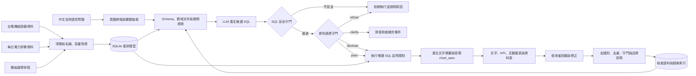

# PowerQuery TW 系統規格與細節

> [README](../README.md) 回答「這個專案解決什麼問題、怎麼跑起來」。
> 這份文件回答「怎麼做的、為什麼這樣做、踩過什麼坑」。
> 文中所有數字都來自實際執行結果，不是從詮釋資料推測的。

## 文件地圖

| 想知道的事 | 看這份文件 |
|---|---|
| 完整系統規格（分層、表定義、附錄 A 語意守門 9 條規則） | [設計規格](superpowers/specs/2026-09-09-text2sql-taipower-design.md) |
| 資料字典（物理表、語意檢視、單位） | [DATA_DICTIONARY.md](DATA_DICTIONARY.md) |
| 查詢管線契約（輸入、輸出、管線順序） | [TEXT2SQL_PIPELINE.md](TEXT2SQL_PIPELINE.md) |
| 語意守門契約（四種決策與依據） | [SEMANTIC_GUARD.md](SEMANTIC_GUARD.md) |
| 評測設計與指標定義 | [EVALUATION.md](EVALUATION.md) |
| 使用方式、執行模式、自動語料學習 | [SERVING.md](SERVING.md) |
| API 契約 | [src/serving/API_CONTRACT.md](../src/serving/API_CONTRACT.md) |
| 系統卡（用途、可回答範圍、已知偏誤） | [SYSTEM_CARD.md](SYSTEM_CARD.md) |
| 資料對齊方法與驗證結果 | [taipower_align/README.md](../taipower_align/README.md) |
| 電廠主檔欄位定義與官方來源 | [taipower_align/PLANTS.md](../taipower_align/PLANTS.md) |
| 資料血緣（來源 → 清洗 → 對齊 → 表，五份 CSV） | [docs/lineage/](lineage/) |
| 資料擴充計畫與未接入資料盤點 | [DATA_ROADMAP.md](DATA_ROADMAP.md) |
| 公開離線服務架構 | [PUBLIC_OFFLINE_SERVING.md](../PUBLIC_OFFLINE_SERVING.md) |
| 顯名、再散布與授權 | [ATTRIBUTION.md](../ATTRIBUTION.md) |
| 逐儲存點的開發紀錄與回退方式 | [log.md](../log.md) |

---

## 1. 系統設計

### 1.1 查詢流程



離線模式走的是同一條路的左半邊：由規則 router 直接產生 SQL，不呼叫遠端模型，但**守門與執行完全共用同一套程式**。線上模式只是在規則沒有涵蓋時，多接一段 LLM 生成。

### 1.2 雙守門機制

| 守門層 | 檢查內容 | 避免的風險 |
|---|---|---|
| SQL 安全守門 | 唯讀限制、允許清單、SQL AST、查詢筆數及逾時 | 修改資料、任意查詢、資源濫用 |
| 資料語意守門 | 指標定義、單位、時間粒度、資料涵蓋與欄位完整性 | 「SQL 能跑，但答案是錯的」 |

語意守門不採用單一的「通過／拒絕」，而是依風險分級：

- `refuse`：問題會導致錯誤結論，例如把跨日瞬時功率加總成發電量。
- `disclose`：結果仍可參考，但必須顯示資料缺漏或估計限制。
- `clarify`：名稱或日期條件不明確，需要使用者補充後才能查詢。
- `pass`：沒有命中任何規則。

完整 9 條規則與 SQL 形狀定義見[專案規格附錄 A](superpowers/specs/2026-09-09-text2sql-taipower-design.md#附錄-a語意守門規則全表)，決策契約見 [SEMANTIC_GUARD.md](SEMANTIC_GUARD.md)。

### 1.3 增量語料學習

系統建立可追溯的語料更新流程，讓常見新問法與人工修正能逐步改善 Text2SQL 表現：

```text
成功查詢／人工修正
        ↓
候選 question–SQL pair
        ↓
去識別化 → 去重 → SQL 安全驗證 → 語意驗證 → 結果一致性測試
        ↓
staging corpus → benchmark 回歸通過 → 正式 corpus
        ↓
自動重建 TF-IDF／向量檢索索引並留下版本紀錄
```

這裡的「自動訓練」是**自動擴充高品質語料並重建檢索索引**，不是讓模型直接把每次回答當成正確答案。未經驗證的查詢不得進入正式 corpus，benchmark 也不得成為訓練資料，以防止錯誤累積與評測洩漏。

規則路由產生的確定性結果通過全部關卡後可自動發布；線上模型產生的內容只會成為 `pending_review` 候選，等人工審核。詳細狀態機與 API 見 [SERVING.md](SERVING.md#語料治理與來源調閱)。

### 1.4 自動圖表回答

查詢結果除了文字與資料表，也能依欄位型別及問題意圖產生圖表：

| 資料形狀 | 建議圖表 | 適用問題 |
|---|---|---|
| 日期＋數值 | 折線圖 | 尖峰負載或備轉容量的時間趨勢 |
| 類別＋數值 | 長條圖 | 不同機組、燃料或電廠比較 |
| 兩個連續數值 | 散點圖 | 裝置容量與實測最大出力關係 |
| 單一或不適合繪圖的結果 | KPI／資料表 | 最大值、明細或文字型結果 |

後端只產生白名單格式的 `chart_spec`，前端使用 Plotly 渲染；圖表標題、座標軸、單位、資料來源與限制揭露皆由查詢結果推導。若結果不適合視覺化，系統回傳 `chart_spec: null`，而不是硬畫一張誤導性圖表。

---

## 2. 資料工程與踩坑紀錄

### 2.1 台電機組對齊成果

「水火力發電廠位置及機組設備」與「過去電力供需資訊」已完成跨資料集對齊，並以裝置容量與歷史實測最大值進行客觀驗證，而非只依賴字串相似度。

| 成果 | 數量／結果 |
|---|---:|
| 機組主檔對齊 | **175 台，100% 完成** |
| 每日供需欄位 | 64 個機組／彙總欄位 |
| 可對應機組主檔的欄位 | **43 個（67%）** |
| 轉換後長表 | **36,928 筆** |
| 目前資料期間 | 2025-01-01 ～ 2026-07-31，共 577 天 |
| 已識別資料陷阱 | 10 類 |

其餘 21 個欄位主要屬於核能、民營電廠、汽電共生及再生能源彙總，本來就不在該機組主檔的涵蓋範圍內，並非單純的配對失敗。詳細方法、欄位定義及驗證結果見 [`taipower_align/README.md`](../taipower_align/README.md)。

### 2.2 踩坑：有電廠名單，還不能直接分權限

一開始想把資料全部掛到電廠，再讓使用者只看自己廠的資料。但查下去發現：**原始資料有的是單一機組、有的是整座電廠、有的是好幾個電廠加在一起，不能全部用同一種方式處理。**

#### 坑一：22 個電廠不是全部資料的範圍

原本的機組設備資料只有 22 筆台電水火力電廠／分廠，但每日供需資料還包含核能、民營電廠，以及風力、太陽能、汽電共生合計。只拿這 22 筆去配，部分資料一定找不到所屬電廠。

**處理方式：**核對台電與能源署的官方資料，補上 9 個民營電廠及核一、核二、核三，主檔擴充為 **34 筆**，並記錄不同叫法與來源。這份名單涵蓋目前專案需要的電廠，不是全臺所有發電設施名冊。前面提到的 43 欄是「已有機組主檔對照」的範圍；補齊電廠名單，不代表也補齊了每台機組的設備資料。

#### 坑二：合計數字不能硬拆給各電廠

例如資料只有「離島合計出力 15 萬瓩」（示意數字），包含尖山、塔山、珠山。知道合計裡有哪些廠，也無法知道這 15 萬瓩各廠占多少，更不能把 15 萬瓩直接當作尖山出力。

「氣渦輪」也有同樣問題：原始欄位是全系統合計，目前機組主檔只配到台中部分機組。若把整筆掛給台中，就會把其他來源的出力一起算進去。

**處理方式：**逐欄確認資料範圍，將每日 64 個欄位分成 **58 個單廠欄位、6 個共用彙總欄位**。共用彙總為離島、其他小水力、氣渦輪、汽電共生、風力發電、太陽能發電。查詢時保留原始合計，標示已知涵蓋電廠；組成不完整就明講，不能假裝已經拆出各廠數值。同一廠的多台機組合計，仍按該廠權限處理。

#### 坑三：找不到機組，不代表不知道是哪個電廠

138 筆歲修中，原本有 13 筆找不到對應的機組 ID。核對後發現，大潭 8、9 號機和興達新一號機可以確認所屬電廠，只是舊機組主檔缺資料；「立霧」則能確認屬於東部發電廠，但不能硬指定成某一台機組。

**處理方式：**把「確認電廠」和「確認機組」分開記錄。現在 **138 筆都能確認電廠，其中 125 筆有機組 ID，13 筆只確認到電廠**。這 13 筆保留空白的機組 ID，不捏造資料，也不能把興達新一號機誤配到舊燃煤一號機。

### 2.3 踩坑：兩個檔案講同一批電廠，卻對不起來

再生能源的場址主檔（17141）與月發電量（17140）是同一個機關發布的一對檔案，理論上用「發電站名稱」就能串起來。實際下載後發現四個坑。

#### 坑一：小計混在明細裡，容量會多算一倍

97 列場址中有 4 列其實是小計，`發電站編號` 寫成「陸域風力小計」，名稱欄塞「18站」，地址欄塞「含試運轉中機組」。直接 `SUM(裝置容量)` 會得到 **1,514,419 瓩**，但真正的明細合計只有 **757,960 瓩**。

**處理方式：** 依 `發電站編號` 是否含「小計」剔除彙總列，並把兩個數字都寫進對齊報告，讓人一眼看出差異。同一份資料的 8931 也有 10 列小計混在 215 列中，用同一條規則處理。

#### 坑二：同一個電廠，兩個檔寫法不一樣

場址主檔寫「石門風力發電站」，發電量檔寫「石門風力」。直接 join 的結果是 **65 站只對上 10 站**。另外還有欄位名稱與值都是 `中文/English` 黏在一起，而且官方有一筆漏掉分隔符，變成 `彰工風力Changgong Wind Power`。

**處理方式：** 先取雙語字串的中文側（沒有分隔符時額外剝除結尾的拉丁字母），再去掉結尾的「發電站」，對齊率提升到 **64／65（98.5%）**。剩下的兩組命名變體以裝置容量推算容量因數（15.0% 與 12.6%，都在合理範圍）佐證後，寫進 [`configs/renewable_overrides.yaml`](../configs/renewable_overrides.yaml) 並附依據，程式本身不做任何猜測。

#### 坑三：一格壞掉的數字，怎麼確定真值

澎湖湖西風力 2024-07 的發電量是 `357,156.00 2` —— 有千分位逗號、小數點，尾巴還多一個字元。直接取前綴數字是猜測，直接丟掉則會讓該站少一個月。

**處理方式：** 解析器把這種值標為 `suspect` 且**不列入加總**，再去台電 11307 簡明月報對答案。月報表 2-2 顯示該站六部機組毛發電量合計 382,722 度、站級廠用電量 25,566 度，相減正好 357,156 度。確認後才以 overrides 記錄修復。

這趟交叉驗證還意外釐清一件事：**這一欄是淨發電量，不是毛發電量。**拿同月份八個站逐一比對，七個站的 CSV 數值與月報的淨發電量欄完全相同（第八個就是上面那格）。這個定義原始資料沒有寫，靠比對才確定。

#### 坑四：只涵蓋 3～4%，但看起來像全國資料

這兩份檔名叫「再生能源」，實際上只收台電**自己興建**的案場，合計約 758 MW。對照全國風光地熱約 19,000 MW，涵蓋率只有 **3～4%**。

**處理方式：** 這是四個坑裡最危險的一個 —— 前三個會讓數字算錯，這個會讓數字**看起來很合理但差一個數量級**。接入時強制附上「僅限台電自建場站」的範圍揭露，不能讓「2025 年台灣太陽能發了多少度」這類問題拿這份資料作答。

#### 再生能源目前成果

| 項目 | 結果 |
| --- | --- |
| 站名對齊 | 64／65（98.5%），未處理前為 10／65 |
| 場址明細 | 93 列，容量 757,960 瓩，縣市解析 93／93 |
| 發電量 | 1,976 列，1,959 筆可用、16 筆缺值、1 筆修復 |
| 未對齊 | 0。`中屯風力` 經月報證實存在（4,800 瓩、112.10.19 起安全性停機），以補充檔補上並標為 `supplemented` |
| 已上線 | `dim_re_site` 65 站、`fact_re_monthly` 1,976 月、`v_re_generation` 可查詢 |

對齊率與覆蓋率分開報：**對齊率 98.5%** 只算兩個官方檔真正對上的 64 站，**覆蓋率 100%** 才包含補充檔補上的那一站，避免把「補上的」講成「對上的」。任何查到 `v_re_generation` 的問題都會附 `RENEWABLE_SELF_BUILT_ONLY` 範圍揭露。

缺值一律存 NULL 而不是 0，`suspect` 值不列入加總，未對齊的名稱保留原值。規則放在 [`src/align/renewable.py`](../src/align/renewable.py)（無 I/O 純函式），人工裁決放在 config，產出 [re_station_crosswalk.csv](../taipower_align/re_station_crosswalk.csv) 與 `reports/alignment.json` 的 `renewable` 區段，對齊率低於 90% 時整份報告判定 fail。完整盤點與接入順序見[資料擴充計畫](DATA_ROADMAP.md)。

---

## 3. 權限、範圍與職責分離

### 3.1 權限怎麼分

| 資料範圍 | 本廠帳號 | 全部權限帳號 |
| --- | --- | --- |
| 單廠明細或同廠機組合計 | 只能看自己廠 | 全部可看 |
| 跨廠彙總 | 可看，標示合計範圍 | 可看 |
| 全系統負載、備轉容量、發電類別成本 | 可看 | 可看 |
| 真正尚未確認所屬電廠的資料 | 可看 | 可看 |

最後一項是本專案明確選擇的開放規則。**一旦確認所屬電廠，就改依該廠權限處理；不能只因機組 ID 是空白，就把資料當作所有人共用。**

### 3.2 授權對照表：從 CSV 到查詢改寫

| 檔案 | 用途 |
| --- | --- |
| [plants.csv](../taipower_align/plants.csv) | 34 筆電廠主檔，包含編號、名稱、類型、燃料、別名與來源 |
| [daily_plant_scope.csv](../taipower_align/daily_plant_scope.csv) | 64 個每日欄位的單廠／共用分類，以及已知電廠對照 |
| [outage_plant_map.csv](../taipower_align/outage_plant_map.csv) | 138 筆歲修的電廠對照，區分是否已確認機組 |

這三個檔已接進建庫流程：`dim_plant_scope`、`b_column_scope`、`bridge_b_column_plant`、`outage_scope` 四張授權對照表由它們產生；查詢時再由 [`scope_guard`](../src/text2sql/scope_guard.py) 依帳號綁定的電廠改寫**已通過安全驗證**的 SQL，把每個受管檢視包成只含該帳號可見列的子查詢。限制在後端執行，不是靠提示詞要求 AI 遵守。

**未分類的檢視會被拒絕，不是放行。** `SqlGuard` 放行的每一張檢視都必須列在 `SCOPE_KEYS`（受管）或 `SHARED_VIEWS`（不受管）；兩邊都查不到就丟錯。少了這道，新增一張帶電廠欄位的檢視會讓電廠帳號讀到全部列，而且沒有任何錯誤訊息。有一筆測試斷言「可查詢的檢視集合」與「已分類的檢視集合」完全相等，所以漏掉分類會在 CI 就紅。

想直接看效果：

```bash
uv run python scripts/demo_plant_scope.py
```

同一個問句「列出台中發電廠所有設備」，全權限帳號得到 14 筆，林口帳號得到 0 筆，而林口帳號問自己的廠得到 3 筆。輸出會印出實際送進 SQLite 的 SQL，可以看到受管檢視被包成 `FROM (SELECT * FROM v_unit WHERE "電廠" IN (?))`。

### 3.3 帳號名冊

名冊是一個檔案，預設 `configs/accounts.yaml`（不進版控，格式見 [accounts.example.yaml](../configs/accounts.example.yaml)），路徑可用 `POWERQUERY_ACCOUNT_ROSTER` 指定。名冊不存在時沿用環境變數的單一管理員帳號，範圍為全廠。

| 欄位 | 意義 |
| --- | --- |
| `username` | 帳號名稱，名冊內不可重複 |
| `password` | PBKDF2-SHA256 雜湊，用 `python -m serving.accounts hash` 產生 |
| `scope` | `all` 或一個 `plant_id` |
| `plant_name` | 選填。填了就在解析時與資料庫比對，對不起來即拒絕服務 |
| `can_review` | 預設 `false`。只有 `true` 能核准資料變更與語料晉升 |

**綁定用 `plant_id` 而不是電廠名稱。** 名稱會因改制、更名或全半形差異而變，把授權掛在會變的字串上，等於哪天有人改了一個字，某個帳號就換了一座電廠。

同一個理由，**電廠編號不能每次按名稱排序重新編**。這次保留原有 1–22，新增接續 23–34；建庫時會把三個 CSV 的編號與重建後的名稱逐筆比對，只要編號漂移或有新欄位還沒指定授權範圍就中止建庫。名冊上的 `plant_name` 是同一條檢查在授權層的延伸。

盤點名冊用唯讀指令，不需要開任何網頁端點：

```bash
uv run python -m serving.accounts list
```

它印出每個帳號的範圍、審核權、綁定的電廠，以及**綁定現在是否仍對得上資料庫**，並以離開碼回報（0 = 全部對得上，1 = 有問題或驗不了）。讀不到資料庫時回報「未驗證」而不是 ok —— 未驗不等於通過。

**沒有新增或修改帳號的介面，那是刻意的。** 能在介面上建帳號的人就能建一個全權限審核帳號來核准自己的變更，四眼原則當場失效。密碼只從 stdin 進、雜湊只從 stdout 出，中間沒有任何一段會進入 log、錯誤訊息或瀏覽器。改名冊需要主機存取權 —— 這個提權路徑是實體的，不是網路的。

公開離線服務會自動產生兩個互為審核者的帳號，見 [PUBLIC_OFFLINE_SERVING.md](../PUBLIC_OFFLINE_SERVING.md)。

### 3.4 電廠帳號是資料使用者，不是系統管理者

只收窄「看得到哪些列」並不夠 —— 管理端點不經 `scope_guard`，其中 `/api/data/files/{dataset}` 會直接送出所有電廠的原始來源檔。因此資料管理、語料審核、執行環境設定一律要求 `scope: all`（HTTP 403），只有登入與登出對任何帳號開放。

另外兩條：**session 失效時權限往下掉而不是往上跳**（帶了已過期的 cookie 回 401，不會悄悄退回「匿名可看全部」）；**電廠帳號不能查原始開放資料檔**（`/api/raw/*` 與 `query_scope` 的 `raw`／`auto` 不經 `scope_guard`，開放給電廠帳號等於留一條繞過授權的路）。

### 3.5 職責分離：誰能核准，以及不能核准誰的

資料範圍管的是「看得到什麼」，這條管的是「誰能讓東西上線」，兩者是不同的軸。這一軸有兩道，擋在不同層：

**第一道：審核是一種能力，不是管理權的副作用。** `can_review` 預設 false，只有明寫 true 的帳號能核准（HTTP 403）。沒有這道的話，任何 `scope: all` 帳號一建立就默默取得發布權 —— 權限預設開啟，與這個系統其他地方的 fail-closed 相反。綁定電廠的帳號不可以有審核權，審核是全廠範圍的職責。

**名冊至少要有一個審核者才載入得了，而且建議兩個。** 唯一的審核者自己不能提案（下一道會擋），所以他一旦需要提案就卡死；他請假時也沒有人能發布。`accounts list` 只有一個審核者時會提醒。

**第二道：提案人不能核准自己的提案。** 核准是發布邊界，所以 `created_by` 等於 `reviewed_by` 時回 403。一個人就能跨過發布邊界的系統，稽核日誌裡那兩個欄位記的是同一件事，證明不了任何分工。被擋下的自審會寫進稽核鏈（`self_approval_refused`），不是靜默失敗。

兩道的層級不同，留痕方式也不同：審核權是授權問題，擋在 API 層，請求不會進到服務；四眼是領域規則，擋在服務層並留痕。

**駁回不受此限制** —— 撤回自己的提案不會讓任何東西上線。

單人部署可用 `POWERQUERY_ALLOW_SELF_APPROVAL=true` 放行，但每一筆自審都會在變更紀錄與稽核鏈標上 `self_approved`。逃生口是明寫且留痕的，不是把規則關掉。

**手動補充的語料可以自審，自動抓取的不行。** 管理介面的「手動補充語料」表單送出後，候選記為 `source: manual`，供稿者若有審核權可以自己核准。放寬的只有「誰能核准」—— **驗證一道都沒有少**：SQL 先過安全守門、實際執行取得真實結果（查不到資料直接擋下），審核時再跑完整六道（洩漏、去重、SQL 守門、問句語意、SQL 語意、重跑結果比對、檢索回歸）。

理由是四眼補的是「沒有其他檢查」的缺口：資料變更沒有內容層級的自動驗證，人是唯一的內容檢查；語料則有六道。而且手動提供是明示的提案動作，不像自動抓取那樣可以偽裝成一般查詢。

**語料晉升套用同一條規則，但方式不同。** 語料候選是系統從成功查詢自動抓下來的，沒有「提案人」欄位可比對 —— 所以先記錄：候選會記下是哪個登入帳號的查詢產生了它（`proposed_by`），再據此擋下自己核准自己問出來的候選。匿名查詢記為 `None` 且不套此規則：匿名不是一個身分，兩個不同訪客都會長一樣，拿來比對只會擋到不相干的人，也擋不住真的想繞的人。這是這條規則已知的邊界，寫在這裡而不是留在程式碼裡。

### 3.6 反向代理後面的來源判斷

服務在反向代理後面時（例如 Tailscale Funnel → `127.0.0.1`），所有外部訪客在 `request.client` 裡都是同一個 loopback 位址。這會讓登入限速變成全域共用一桶，也會讓「預設帳密只准本機」誤放。

設 `POWERQUERY_TRUSTED_PROXIES` 後，服務才從 `X-Forwarded-For` 由右往左跳過信任代理取真正的來源。**未設定時完全不採信該 header** —— 否則任何人都能自己填一個來源位址，同時繞過上述兩道。任何一段無法解析時回報來源未知，讓限速與 loopback 判斷從嚴，不猜。

完整欄位定義、官方來源與限制見[電廠主檔說明](../taipower_align/PLANTS.md)。

---

## 4. 資料模型

以 SQLite 建立星狀模型，把原始資料的複雜欄名與不同粒度轉換成對 LLM 較穩定的語意層：

```text
dim_plant ──< dim_unit ──< bridge_b_column
                              │
                              ▼
                       fact_daily_peak
                              │
                              ├── dim_date
                              └── dim_outage

dim_re_site ──< fact_re_monthly        台電自建再生能源，月粒度淨發電量

meta_manifest   資料版本、涵蓋期間與來源
meta_pitfall    已知限制、受影響對象與守門規則依據
v_*             提供給 Text2SQL 的中文語意檢視
```

這個設計把「儲存結構」與「LLM 可見的查詢介面」分離：底層採容易維護的英文欄位與正規化結構，模型只允許查詢經審核的中文 `v_*` views。完整表定義與欄位單位見[資料字典](DATA_DICTIONARY.md)。

---

## 5. 資料來源

八份台電開放資料，全部由 `python -m ingest.fetch` 下載並以 SHA-256 內容定址封存，相同內容不會產生重複快照。

| 台電開放資料 | 用途 | 更新頻率 |
|---|---|---|
| [水火力發電廠位置及機組設備（8934）](https://data.gov.tw/dataset/8934) | 電廠、機組、燃料、裝置容量與商轉日期 | 不定期 |
| [過去電力供需資訊（19995）](https://data.gov.tw/dataset/19995) | 每日尖峰負載、備轉容量及尖峰時刻機組出力 | 每月 |
| [未來兩年機組大修停機排程（35393）](https://data.gov.tw/dataset/35393) | 解釋特定機組長時間停機或零出力 | 每 6 個月 |
| [各種發電方式之發電成本（10856）](https://data.gov.tw/dataset/10856) | 年度、分發電方式的每度成本，區分審定與自編決算 | 年度 |
| [再生能源各場址資料（17141）](https://data.gov.tw/dataset/17141) | 風、光、地熱的場址主檔，`裝置容量(瓩)` 與機組主檔同單位 | 每月 |
| [自建各類再生能源發電量（17140）](https://data.gov.tw/dataset/17140) | **目前唯一的「發電量」資料**，單位為度、月粒度 | 每月 |
| [核能發電廠位置及機組設備（10858）](https://data.gov.tw/dataset/10858) | 核能機組的裝置容量 | 有異動時 |
| [各機組發電量即時資訊（8931）](https://data.gov.tw/dataset/8931) | IPP、汽電共生、儲能與風光彙總欄位的裝置容量 | 每 10 分鐘 |

> [!WARNING]
> **「過去電力供需資訊」採滾動視窗**，只提供上一年度及本年度至上月份資料，舊資料可能被覆蓋。專案定期封存原始檔，並將資料版本與涵蓋日期寫入 `meta_manifest`，才能維持可重現性。

> [!WARNING]
> **8931 必須接 JSON 端點**，資料集頁面匯出的 CSV 會遺失頂層的 `DateTime` 時間戳。

實測規模與各檔的資料陷阱見[資料擴充計畫](DATA_ROADMAP.md)；逐層的來源、清洗規則與產物見[資料血緣清單](lineage/)。

---

## 6. 評測設計

同時評估「查詢做不做得到」與「系統會不會阻止錯誤答案」，避免只用 SQL 字串相似度美化成果。

| 指標 | 衡量目的 |
|---|---|
| SQL 執行正確率 | 查詢能否執行並得到正確結果 |
| Result Match | 生成 SQL 與標準答案的查詢結果是否一致 |
| 語意陷阱命中率 | 應阻擋或警示的題目是否正確辨識 |
| 守門誤攔率 | 合法問題是否被錯誤拒絕 |
| 語料內／語料外表現 | 區分記憶題型與真正泛化能力 |

驗收基準：語意陷阱命中率至少 95%、誤攔率不高於 5%，並獨立呈現 `in_corpus=false` 題組結果。另以 ablation study 比較移除檢索、對齊資訊與語意守門後的表現差異，量化各模組的實際貢獻。

`make eval` 在固定 SQLite 快照上執行四份版控題庫（`golden_questions` 80 題、`eval_questions` 60 題、`trap_questions` 45 題、`attack_questions` 15 題），不需要 API key。指標定義與產出檔見 [EVALUATION.md](EVALUATION.md)。

---

## 7. 已知限制

使用者第一次打開時最需要知道的是邊界，所以入門問句直接問得出來：「有哪些電廠」「有哪些燃料別」「資料涵蓋到什麼時候」「總共有幾台機組」。這四句離線由 router 的 `data_scope` 意圖處理、線上由語料檢索支援 —— **兩邊都要有**，否則切換模式就答不出來（有測試釘住）。

而「資料庫有哪些資料可以查詢」「我可以問什麼」這種**後設問句不做成語料**：它的答案是 schema 層級的說明，不是資料列，硬產 SQL 只能去查 `sqlite_master`，而那正是 `SqlGuard` 該擋的東西。為了回答這個問題在白名單上開一個口，代價遠大於收益。改由語意守門回 `clarify`，附上可直接點的替代問句並指向資料總覽。

**問服務自己也是同一類**：「目前有接 API 嗎」「現在是線上還是離線」「用的是哪個模型」的答案在 `/api/health`，不在任何 view 裡，同樣在守門就澄清（`SYSTEM_STATUS_QUESTION`）。比對前先用 `compact_question()` 去空白並統一異體字 —— 實測「資料庫有**甚**麼內容」與「資料庫有**什**麼內容」只差一個字形，前者卻會一路掉到 SQL 錯誤。

**意圖判對但問句缺參數時反問而不是猜**（`MISSING_PARAMETER`）。「某天機組尖峰功率排行榜」沒有說是哪一天，任何模型都推不出來，能做的只有挑一天然後回一張看起來完全正常的表。這一層放在管線最後，模型答得出來的題目走不到它。

限制說明**不寫死在文件裡**。`GET /api/coverage` 與資料總覽分頁的「可以回答什麼，答不出什麼」都是現查的：期間、電廠數、機組數、燃料別、已知陷阱全部來自作用中的資料庫，資料換版後說明自動跟著變。

只有「答不出什麼」無法從現有資料推導，所以宣告在 [configs/coverage.yaml](../configs/coverage.yaml)。**每一條都必須附可驗證的條件** —— 指定檢視不得出現的欄位關鍵字。關鍵字一旦出現就表示那個問題現在答得出來了，測試會失敗並要求更新說明。

這條規則是有來由的：這份清單原本寫「不能回答用電度數」與「不能回答發電量」，但 `v_system` 早就有 `工業用電_百萬度`／`民生用電_百萬度`，`v_re_generation` 也有 `發電量_度`。**過期的限制說明比沒有更糟**，因為它讓使用者相信一件不再為真的事。現在那五條限制每次跑測試都會重驗一次。

目前宣告的限制（實際內容以 `/api/coverage` 為準）：

- **火力與核能機組的發電量**：每日資料是尖峰「時刻」的出力（萬瓩），不是期間累積的發電量（度）。再生能源場站有逐月發電量，但只涵蓋台電自建場站。
- **分電廠或分用戶的用電**：只有全系統的工業與民生兩個數字。
- **電價與售電收入**：完全沒有；成本只有分發電方式的每度成本。
- **碳排放**：沒有排放量或係數。
- **比「日」更細的時間粒度**：最細到日，沒有逐時曲線。

另外幾項屬於資料本身的性質，由 `meta_pitfall` 記錄並由語意守門在查詢時揭露或拒答：部分電廠的機組收在殘差欄位因而無法還原電廠級總出力；核能、IPP、汽電共生與再生能源彙總欄位缺少相同粒度的機組主檔；台電不同資料集存在多套機組命名方式，新增資料源時必須重新驗證對齊規則。

主動揭露限制不是功能缺陷，而是「可信任 Text2SQL」設計的一部分 —— 而讓那份揭露**不會過期**，是同一件事的下半場。

---

## 8. 專案結構與開發里程碑

```text
text2SQL_project/
├── README.md                 # 專案入口（非技術讀者也能讀完）
├── docs/SPEC.md              # 本文件：細節、決策與踩坑
├── docs/superpowers/specs/   # 系統、資料、評測完整規格
├── docs/lineage/             # 資料血緣五份 CSV
├── src/ingest/               # 下載、封存、驗證、建庫
├── src/align/                # 對齊層純函式（無 I/O）
├── src/text2sql/             # 路由、檢索、生成、SQL 守門、語意守門、範圍改寫
├── src/serving/              # FastAPI、帳號、資料治理、語料學習、前端靜態檔
├── src/eval/                 # 離線評測與晉升關卡
├── taipower_align/           # 資料清理、對齊與驗證產物
├── corpus/ benchmarks/       # 語料與四份獨立題庫（訓練／測試分離）
├── configs/                  # 對齊、守門、檢索、涵蓋範圍、人工裁決
├── tests/                    # 38 個測試檔
└── log.md                    # 逐儲存點紀錄與回退方式
```

| 階段 | 內容 | 狀態 |
|---|---|:---:|
| Phase 1 | 原始資料盤點、下載與版本管理 | ✅ |
| Phase 2 | 名稱對齊、長表轉換與資料陷阱分析 | ✅ |
| Phase 3 | SQLite 星狀模型與中文語意檢視 | ✅ |
| Phase 4 | Text2SQL 生成、檢索、失敗重試與增量語料索引 | ✅ |
| Phase 5 | SQL 安全守門與資料語意守門 | ✅ |
| Phase 6 | 題庫、語料晉升閘門、離線評測與 ablation study | ✅ |
| Phase 7 | FastAPI、對話式介面與自動圖表回答 | ✅ |
| Phase 8 | 資料治理、語料人工審核、稽核鏈與一鍵啟動 | ✅ |

### 已知待修

- **版本 id 只由來源內容雜湊決定，不含建置程式的 schema 版本。** 來源資料沒變時，即使建庫程式新增了資料表，服務端也拿不到新 schema；若強制用新程式重建同一組來源，產出的 checksum 與版本紀錄不符會被整合性檢查拒絕。建議把 schema 版本納入版本 id。詳見 [log.md](../log.md) 的 CP-039。
